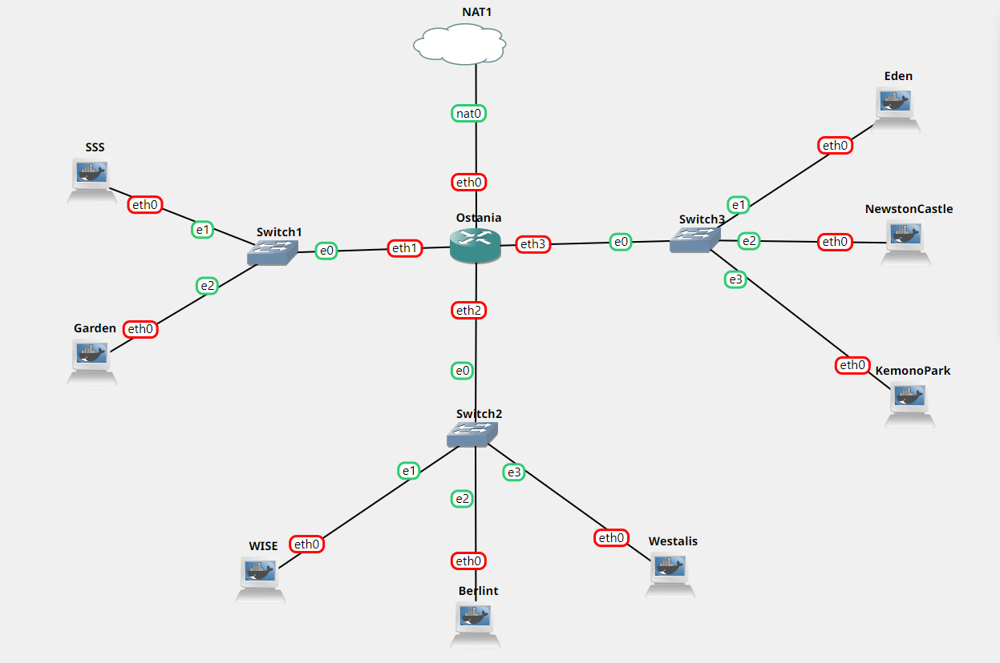
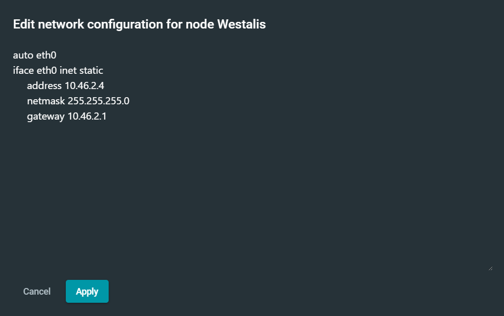
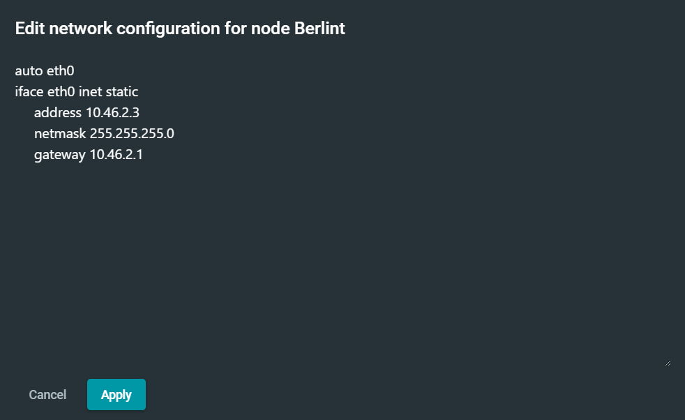
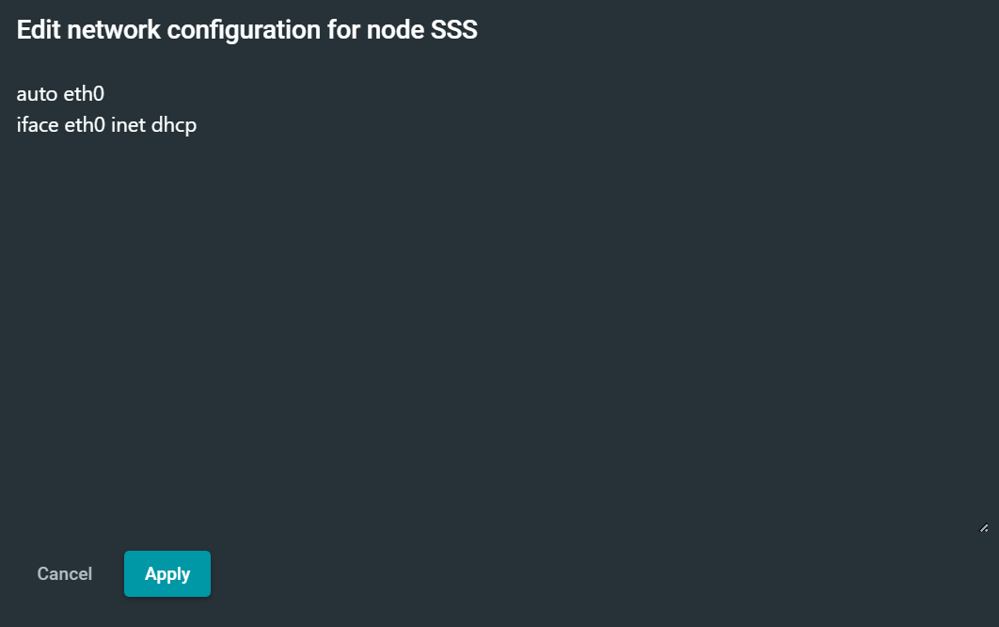

# Jarkom-Modul-3-ITB03-2022
---
Kelompok ITB03:
1. Haffif Rasya Fauzi - 5027201002
2. M. Hilmi Azis - 5027201049
3. Gennaro Fajar Mende - 5027201061
---


## **Soal 1**
---
Loid bersama Franky berencana membuat peta tersebut dengan kriteria WISE sebagai DNS Server, Westalis sebagai DHCP Server, Berlint sebagai Proxy Server
### **Penyelesaian Soal 1**
Pertama-tama kami membuat sebuah node yang terhubung dengan internet dengan nama NAT1. Node tersebut kemudian disambungkan dengan router ostania melalui interface `nat0` menuju interface `eth0`. Selanjutnya persiapkan peletakan node-node sesuai dengan yang ada pada soal shift seperti berikut:


Kemudian setting network dari masing-masing node ubuntu dengan fitur Edit network configuration seperti berikut:
**WISE sebagai DNS Server**


**Westalis sebagai DHCP Server**


**Berlint sebagai Proxy Server**



## **Soal 2**
---
Dan Ostania sebagai DHCP Relay. Loid dan Franky menyusun peta tersebut dengan hati-hati dan teliti.
### **Penyelesaian Soal 2**
Pertama-tama kami menyamarkan paket dengan command
```
iptables -t nat -A POSTROUTING -o eth0 -j MASQUERADE -s 10.46.0.0/16
```
Selanjutnya kami melakukan instalasi dari DHCP Relay dengan mengetikan command
```
apt-get update
apt-get install isc-dhcp-relay
```
Lalu lakukan perubahan konfigurasi pada sysctl.conf agar dapat melakukan IP Forwarding
```
net.ipv4.ip_forward=1
```
Kemudian aktifkan perubahan sysctl.conf dengan perintah `sysctl -p`. Lalu perbaharui konfigurasi `isc-dhcp-relay` dengan menentukan peletakan `DHCP Server` pada `Westalis` dengan alamat IP `10.46.2.4` dan `INTERFACES` diisi dengan `eth1 eth3 eth2` karena DHCP Relay (Ostania) akan meneruskan DHCP request dari network interface `eth1` dan `eth2` sehingga diteruskan ke `DHCP Server` melalui `eth3`. Setelah sudah maka service dari `DHCP Relay` akan direstart dengan command service `isc-dhcp-relay restart`.


## **Soal 3**
---
Semua client yang ada HARUS menggunakan konfigurasi IP dari DHCP Server. Client yang melalui Switch1 mendapatkan range IP dari [prefix IP].1.50 - [prefix IP].1.88 dan [prefix IP].1.120 - [prefix IP].1.155
### **Penyelesaian Soal 3**
Pertama-tama kami melakukan tahap persiapan dengan menyambungkan `Westalis` dengan `Ostania` yang sebagai Router dengan command:
```
echo 'nameserver 192.168.122.1' > /etc/resolv.conf
```
Lalu kami melakukan persiapan dalam mendownload `DHCP Server`
```
apt-get update
apt-get install isc-dhcp-server -y
dhcpd --version
```
Selanjutnya menspesifikasikan penggunaan dari eth0 agar dapat melakukan relay ke DHCP Relay Ostania dengan command:
```
echo 'INTERFACES="eth0"' > /etc/default/isc-dhcp-server
```
Kemudian kami mengkonfigurasikan Client pada Switch 1 tepatnya pada file `dhcpd.conf` dengan pendefinisian subnet yang akan digunakan, dns, range, waktu peminjaman alamat dhcp sementara, alamat broadcast, dan routers yang dituju. Tak lupa agar DHCP Server berjalan dengan lancar perlu deklarasi subnet yang terkoneksi pada Westalis pada 
```
/etc/dhcp/dhcpd.conf
```
yang mana subnet ini hanya harus dideklarasikan atau dikenali tetapi tidak harus memiliki settingan dhcp.
```
subnet 10.46.2.0 netmask 255.255.255.248{
}
```
Selanjutnya setting subnet Client sesuai dengan range yang diminta pada soal sebagai berikut:
```
subnet 10.46.1.0 netmask 255.255.255.0 {
    range  10.46.1.50 10.46.1.88;
    range  10.46.1.120 10.46.1.155;
    option routers 10.46.1.1;
    option broadcast-address 10.46.1.255;
    option domain-name-servers 10.46.2.2;
    default-lease-time 300;
    max-lease-time 6900;
}
```
Ketika konfigurasi sudah, maka yang perlu dilakukan adalah restart dari DHCP Server dengan command:
```
service isc-dhcp-server restart
```


## **Soal 4**
---
Client yang melalui Switch3 mendapatkan range IP dari [prefix IP].3.10 - [prefix IP].3.30 dan [prefix IP].3.60 - [prefix IP].3.85
### **Penyelesaian Soal 4**
Dalam hal ini kami hanya cukup memperbaharui file konfigurasi dhcpd.conf dengan pendefinisian dari subnet yang ada pada Switch 3 dengan command:
```
subnet 10.46.3.0 netmask 255.255.255.0 {
    range  10.46.3.10 10.46.3.30;
    range  10.46.3.60 10.46.3.85;
    option routers 10.46.3.1;
    option broadcast-address 10.46.3.255;
    option domain-name-servers 10.46.2.2;
    default-lease-time 600;
    max-lease-time 6900;
}
```
selanjutnya seperti biasa setelah melakukan konfigurasi maka restart dari DHCP Server dengan command:
```
service isc-dhcp-server restart
```

## **Soal 5**
---
Client mendapatkan DNS dari WISE dan client dapat terhubung dengan internet melalui DNS tersebut.
### **Penyelesaian Soal 5**
Dalam hal ini kami membuat setiap node Client dengan network configuration sebagai berikut:


Lalu agar dapat terhubung dengan internet akan tetapi melalui IP DNS Server maka perlu dilakukan forwarders pada named.conf.options dengan command berikut. Tetapi hal ini tetap memerlukan tahap persiapan dengan menghubungkan node `WISE` dengan Router `Ostania` dan instalasi dari bind9 untuk configurasinya sebagai berikut:
```
# WISE
echo "nameserver 192.168.122.1" > /etc/resolv.conf
        apt-get update
        apt-get install bind9 -y

echo "
options {
        directory \"/var/cache/bind\";
        forwarders {
                8.8.8.8;
                8.8.8.4;
        };
        // dnssec-validation auto;
        allow-query { any; };
        auth-nxdomain no;    # conform to RFC1035
        listen-on-v6 { any; };
};
" > /etc/bind/named.conf.options
```
Setelah sudah maka dapat melakukan restart dari Bind9 pada `WISE` dengan command:
```
service bind9 restart
```
Bukti hasil terkoneksi Client dengan DNS Server dan terhubung internet:

