# Jarkom-Modul-3-ITB03-2022
---
Kelompok ITB03:
1. Haffif Rasya Fauzi - 5027201002
2. M. Hilmi Azis - 5027201049
3. Gennaro Fajar Mende - 5027201061
---


## **Soal 1**
---
Loid bersama Franky berencana membuat peta tersebut dengan kriteria WISE sebagai DNS Server, Westalis sebagai DHCP Server, Berlint sebagai Proxy Server
### **Penyelesaian Soal 1**
Pertama-tama kami membuat sebuah node yang terhubung dengan internet dengan nama NAT1. Node tersebut kemudian disambungkan dengan router ostania melalui interface `nat0` menuju interface `eth0`. Selanjutnya persiapkan peletakan node-node sesuai dengan yang ada pada soal shift seperti berikut:


Kemudian setting network dari masing-masing node ubuntu dengan fitur Edit network configuration seperti berikut: <br><br>
**WISE sebagai DNS Server**


**Westalis sebagai DHCP Server**


**Berlint sebagai Proxy Server**


**SSS, Garden, NewstonCastle, dan kemonoPark sebagai Client**
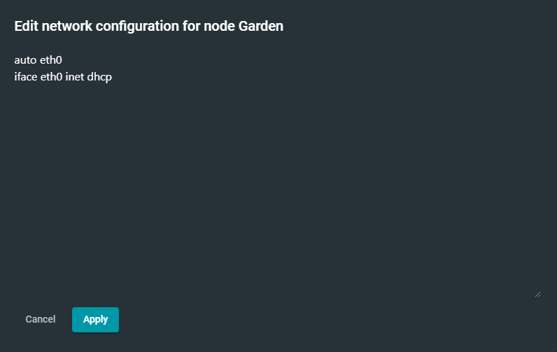

**Eden sebagai Client (alamat yang tetap)**
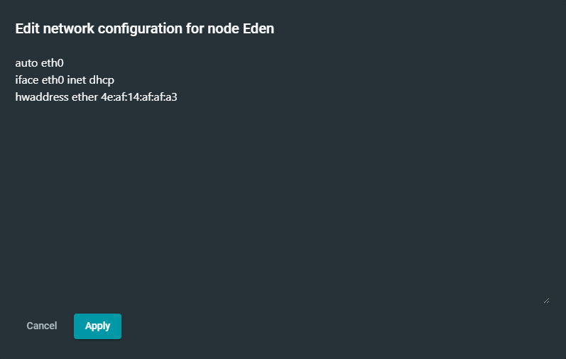

## **Soal 2**
---
Dan Ostania sebagai DHCP Relay. Loid dan Franky menyusun peta tersebut dengan hati-hati dan teliti.
### **Penyelesaian Soal 2**
**Ostania sebagai DHCP relay**

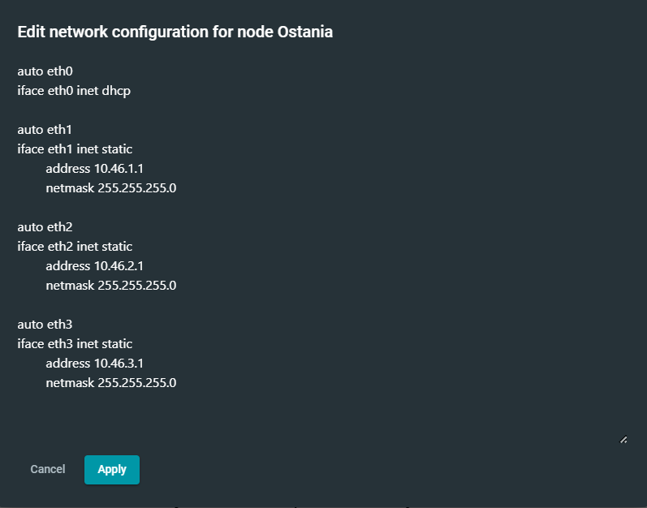

Lalu, kami menyamarkan paket dengan command
```
iptables -t nat -A POSTROUTING -o eth0 -j MASQUERADE -s 10.46.0.0/16
```
Selanjutnya kami melakukan instalasi dari DHCP Relay dengan mengetikan command
```
apt-get update
apt-get install isc-dhcp-relay
```
Lalu lakukan perubahan konfigurasi pada sysctl.conf agar dapat melakukan IP Forwarding
```
net.ipv4.ip_forward=1
```
Kemudian aktifkan perubahan sysctl.conf dengan perintah `sysctl -p`. Lalu perbaharui konfigurasi `isc-dhcp-relay` dengan menentukan peletakan `DHCP Server` pada `Westalis` dengan alamat IP `10.46.2.4` dan `INTERFACES` diisi dengan `eth1 eth3 eth2` karena DHCP Relay (Ostania) akan meneruskan DHCP request dari network interface `eth1` dan `eth2` sehingga diteruskan ke `DHCP Server` melalui `eth3`. Setelah sudah maka service dari `DHCP Relay` akan direstart dengan command service `isc-dhcp-relay restart`.


## **Soal 3**
---
Semua client yang ada HARUS menggunakan konfigurasi IP dari DHCP Server. Client yang melalui Switch1 mendapatkan range IP dari [prefix IP].1.50 - [prefix IP].1.88 dan [prefix IP].1.120 - [prefix IP].1.155
### **Penyelesaian Soal 3**
**[ Ostania ] -> DHCP Relay** <br>
Lakukan konfigurasi pada Fosha dengan melakukan edit file `/etc/default/isc-dhcp-relay` dengan konfigurasi berikut:
```
# Defaults for isc-dhcp-relay initscript
# sourced by /etc/init.d/isc-dhcp-relay
# installed at /etc/default/isc-dhcp-relay by the maintainer scripts

#
# This is a POSIX shell fragment
#

# What servers should the DHCP relay forward requests to?
SERVERS="10.45.2.4"

# On what interfaces should the DHCP relay (dhrelay) serve DHCP requests?
INTERFACES="eth1 eth3 eth2"

# Additional options that are passed to the DHCP relay daemon?
OPTIONS=""
```
**[ Westalis ] -> DHCP Server** <br>
Pertama-tama kami melakukan tahap persiapan dengan menyambungkan `Westalis` dengan `Ostania` yang sebagai Router dengan command:
```
echo 'nameserver 192.168.122.1' > /etc/resolv.conf
```
Lalu kami melakukan persiapan dalam mendownload `DHCP Server`
```
apt-get update
apt-get install isc-dhcp-server -y
dhcpd --version
```
Selanjutnya menspesifikasikan penggunaan dari eth0 agar dapat melakukan relay ke DHCP Relay Ostania dengan command:
```
echo 'INTERFACES="eth0"' > /etc/default/isc-dhcp-server
```
Kemudian kami mengkonfigurasikan Client pada Switch 1 tepatnya pada file `dhcpd.conf` dengan pendefinisian subnet yang akan digunakan, dns, range, waktu peminjaman alamat dhcp sementara, alamat broadcast, dan routers yang dituju. Tak lupa agar DHCP Server berjalan dengan lancar perlu deklarasi subnet yang terkoneksi pada Westalis pada 
```
/etc/dhcp/dhcpd.conf
```
yang mana subnet ini hanya harus dideklarasikan atau dikenali tetapi tidak harus memiliki settingan dhcp.
```
subnet 10.46.2.0 netmask 255.255.255.255{
}
```
Selanjutnya setting subnet Client sesuai dengan range yang diminta pada soal sebagai berikut:
```
subnet 10.46.1.0 netmask 255.255.255.0 {
    range  10.46.1.50 10.46.1.88;
    range  10.46.1.120 10.46.1.155;
    option routers 10.46.1.1;
    option broadcast-address 10.46.1.255;
    option domain-name-servers 10.46.2.2;
    default-lease-time 300;
    max-lease-time 6900;
}
```
Ketika konfigurasi sudah, maka yang perlu dilakukan adalah restart dari DHCP Server dengan command:
```
service isc-dhcp-server restart
```

Adapun untuk pengecekan IP terhadap client di Switch1 adalah sebagai berikut:
- **SSS** <br> 
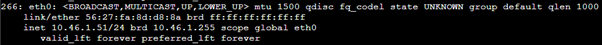


- **Garden** <br>
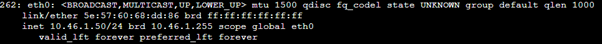


## **Soal 4**
---
Client yang melalui Switch3 mendapatkan range IP dari [prefix IP].3.10 - [prefix IP].3.30 dan [prefix IP].3.60 - [prefix IP].3.85
### **Penyelesaian Soal 4**
**[ Westalis ] -> DHCP Server** <br>
Dalam hal ini kami hanya cukup memperbaharui file konfigurasi dhcpd.conf dengan pendefinisian dari subnet yang ada pada Switch 3 dengan command:
```
subnet 10.46.3.0 netmask 255.255.255.0 {
    range  10.46.3.10 10.46.3.30;
    range  10.46.3.60 10.46.3.85;
    option routers 10.46.3.1;
    option broadcast-address 10.46.3.255;
    option domain-name-servers 10.46.2.2;
    default-lease-time 600;
    max-lease-time 6900;
}
```
selanjutnya seperti biasa setelah melakukan konfigurasi maka restart dari DHCP Server dengan command:
```
service isc-dhcp-server restart
```
Adapun untuk pengecekan IP terhadap client di Switch3 adalah sebagai berikut:

- **Eden** <br>
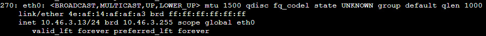


- **NewstonCastle** <br>
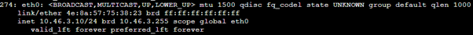


- **KemonoPark** <br>
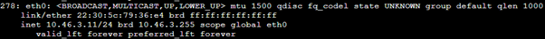


## **Soal 5**
---
Client mendapatkan DNS dari WISE dan client dapat terhubung dengan internet melalui DNS tersebut.
### **Penyelesaian Soal 5**
**[ Westalis ] -> DHCP Server** <br>
Untuk client mendapatkan DNS dari WISE diperlukan konfigurasi pada file `/etc/dhcp/dhcpd.conf` pada Westalis dengan `option domain-name-servers 10.45.2.2;`

**[ WISE ] -> DNS Server** <br>
Supaya semua client dapat terhubung internet pada WISE diberikan konfigurasi pada file `/etc/bind/named.conf.options` dengan sebagai berikut:
```
options {
        directory \"/var/cache/bind\";
        forwarders {
                8.8.8.8;
                8.8.8.4;
        };
        // dnssec-validation auto;
        allow-query { any; };
        auth-nxdomain no;    # conform to RFC1035
        listen-on-v6 { any; };
};
```
Setelah sudah maka dapat melakukan restart dari Bind9 pada `WISE` dengan command:
```
service bind9 restart
```
Bukti hasil terkoneksi Client dengan DNS Server dan terhubung internet:

- **SSS** <br>


- **Garden** <br>
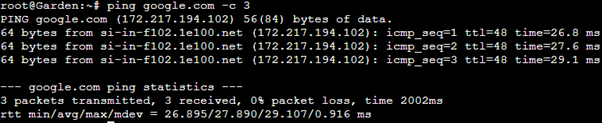


- **Eden** <br>
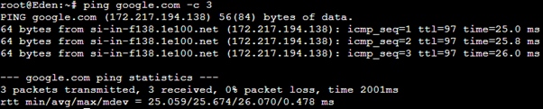


- **NewstonCastle** <br>
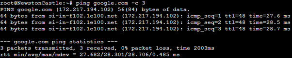


- **KemonoPark** <br>
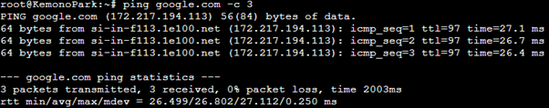


## **Soal 6**
Lama waktu DHCP server meminjamkan alamat IP kepada Client yang melalui Switch1 selama 5 menit sedangkan pada client yang melalui Switch3 selama 10 menit. Dengan waktu maksimal yang dialokasikan untuk peminjaman alamat IP selama 115 menit

### **Penyelesaian Soal 6**
**[ Westalis ] -> DHCP Server** <br>
Pada subnet interface switch 1 dan 3 ditambahkan konfigurasi berikut pada file `/etc/dhcp/dhcpd.conf`

```
subnet 10.45.1.0 netmask 255.255.255.0 {
    ...
    default-lease-time 300; 
    max-lease-time 6900;
    ...
}
subnet 10.45.3.0 netmask 255.255.255.0 {
    ...
    default-lease-time 600;
    max-lease-time 6900;
    ...
}
```


## **Soal 7**
Loid dan Franky berencana menjadikan Eden sebagai server untuk pertukaran informasi dengan alamat IP yang tetap dengan IP [prefix IP].3.13.

### **Penyelesaian Soal 7**
**[ Westalis ] -> DHCP Server** <br>
Menambahkan konfigurasi untuk fixed address pada `/etc/dhcp/dhcpd.conf` dengan sebagai berikut:

```
host Eden {
    hardware ethernet 4e:af:14:af:af:a3;
    fixed-address 10.46.3.13;
}
```

**[ Eden ]** <br>
Kemudian, tidak lupa untuk mengganti konfigurasi pada file `/etc/network/interfaces` dengan sebagai berikut:

```
auto eth0
iface eth0 inet dhcp
hwaddress ether 4e:af:14:af:af:a3
```

Maka Eden akan mendapatkan IP yang tetap yaitu `10.46.3.13`. Untuk dokumentasi yaitu sebagai berikut:
<br>


## **Soal 8**
SSS, Garden, dan Eden digunakan sebagai client Proxy agar pertukaran informasi dapat terjamin keamanannya, juga untuk mencegah kebocoran data.

Pada Proxy Server di Berlint, Loid berencana untuk mengatur bagaimana Client dapat mengakses internet. Artinya setiap client harus menggunakan Berlint sebagai HTTP & HTTPS proxy. Adapun kriteria pengaturannya pertamanya adalah sebagai berikut:

```
Client hanya dapat mengakses internet diluar (selain) hari & jam kerja (senin-jumat 08.00 - 17.00) dan hari libur (dapat mengakses 24 jam penuh)
```

### **Penyelesaian Soal 8**
**[ Westalis ] -> DNS Server** <br>
Menambahkan konfigurasi domain `loid-work.com` dan `franky-work.com` pada WISE:

```
echo "
zone \"loid-work.com\" {
        type master;
        file \"/etc/bind/jarkom/loid-work.com\";
};
zone \"franky-work.com\" {
        type master;
        file \"/etc/bind/jarkom/franky-work.com\";
};
"> /etc/bind/named.conf.local
```

Kemudian, menambahkan domain sebagai berikut:
```
echo "
;
; BIND data file for local loopback interface
;
\$TTL    604800
@       IN      SOA     franky-work.com. root.franky-work.com. (
                              2         ; Serial
                         604800         ; Refresh
                          86400         ; Retry
                        2419200         ; Expire
                         604800 )       ; Negative Cache TTL
;
@               IN      NS      franky-work.com.
@               IN      A       192.212.2.2     ; IP WISE
www             IN      CNAME   franky-work.com.
" > /etc/bind/jarkom/franky-work.com

echo "
;
; BIND data file for local loopback interface
;
\$TTL    604800
@       IN      SOA     loid-work.com. root.loid-work.com. (
                              2         ; Serial
                         604800         ; Refresh
                          86400         ; Retry
                        2419200         ; Expire
                         604800 )       ; Negative Cache TTL
;
@       IN      NS      loid-work.com.
@       IN      A       192.212.2.2     ; IP WISE
www     IN      CNAME   loid-work.com.
" > /etc/bind/jarkom/loid-work.com
```

Lalu, memberikan konfigurasi pada masing-masing domain sebagai berikut:

```
echo '
<VirtualHost *:80>
        ServerAdmin webmaster@localhost
        DocumentRoot /var/www/html
        ServerName loid-work.com
 
        ErrorLog ${APACHE_LOG_DIR}/error.log
        CustomLog ${APACHE_LOG_DIR}/access.log combined
</VirtualHost>
' > /etc/apache2/sites-available/loid-work.com.conf

echo '
<VirtualHost *:80>
        ServerAdmin webmaster@localhost
        DocumentRoot /var/www/html
        ServerName franky-work.com
 
        ErrorLog ${APACHE_LOG_DIR}/error.log
        CustomLog ${APACHE_LOG_DIR}/access.log combined
</VirtualHost>
' > /etc/apache2/sites-available/franky-work.com.conf
```

Selanjutnya, Memberikan Konfigurasi web agar bisa dicek melalui client proxy dengan command `lynx`

**[ Berlint ] -> Proxy Server** <br>
Mendeklarasikan waktu kerja dan diluar kerja, kemudian memberikan hak akses diluar jam kerja dengan sebagai berikut:

```
echo '
acl WORKTIME time MTWHF 08:00-17:00
acl WEEKEND time SA 00:00-23:59
' > /etc/squid/acl-time.conf
```

```
echo '
...
http_access allow !WORKTIME
http_access deny all
...
' > /etc/squid/squid.conf
```

Untuk dokumentasi yaitu sebagai berikut:
- Akses internet pada hari senin jam 10.00:<br>


- Akses internet pada hari senin jam 20.00:<br>
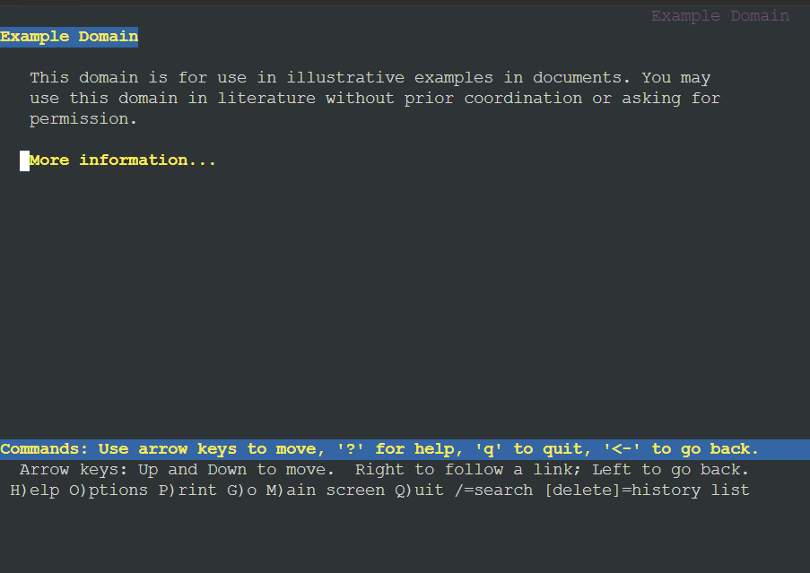


## **Soal 9**
Adapun pada hari dan jam kerja sesuai nomor (1), client hanya dapat mengakses domain loid-work.com dan franky-work.com (IP tujuan domain dibebaskan)

### **Penyelesaian Soal 9**
Mendeklarasikan sejumlah domain kerja dan memberikan hak akses pada saat jam kerja

**[ Berlint ] -> Proxy Server** <br>
```
echo '
loid-work.com
franky-work.com
' > /etc/squid/work-sites.acl
```

```
echo '
acl WORKSITE dstdomain "/etc/squid/work-sites.acl"
' > /etc/squid/acl-site.conf
```

```
echo '
...
http_access allow WORKSITE WORKTIME
...
' > /etc/squid/squid.conf
```

Untuk dokumentasi yaitu sebagai berikut:
- Melakukan akses pada loid-work.com dan franky-work.com ketika jam kerja:<br>
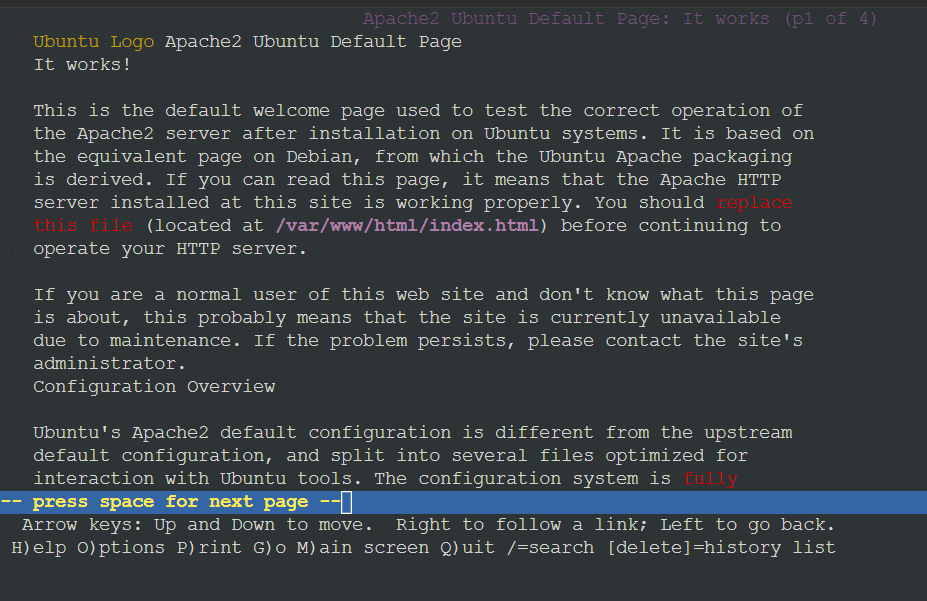
- Melakukan akses pada loid-work.com dan franky-work.com diluar jam kerja:<br>
 <br>
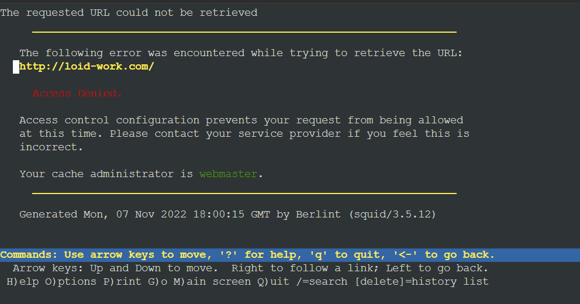
## **Soal 10**
Saat akses internet dibuka, client dilarang untuk mengakses web tanpa HTTPS. (Contoh web HTTP: http://example.com)

### **Penyelesaian Soal 10**
**[ Berlint ] -> Proxy Server** <br>

Port dari HTTPS adalah 443, maka akan deklarasikan terlebih dahulu portnya lalu melarang semua akses yang tidak melewati port 443 dengan sebagai berikut:

```
echo '
acl GOODPORT port 443
acl CONNECT method CONNECT
' > /etc/squid/acl-port.conf
```

```
echo '
...
http_access deny !GOODPORT
http_access deny CONNECT !GOODPORT
...
' > /etc/squid/squid.conf
```

Untuk dokumentasi yaitu sebagai berikut:
- Web HTTP:<br>
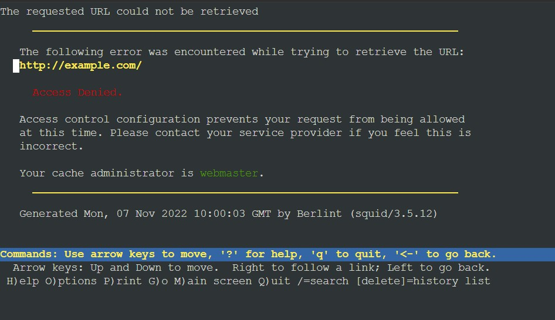
- Web HTTPS:<br>


## **Soal 11**
Agar menghemat penggunaan, akses internet dibatasi dengan kecepatan maksimum 128 Kbps pada setiap host (Kbps = kilobit per second; lakukan pengecekan pada tiap host, ketika 2 host akses internet pada saat bersamaan, keduanya mendapatkan speed maksimal yaitu 128 Kbps)

### **Penyelesaian Soal 11**
**[ Berlint ] -> Proxy Server** <br>
Untuk membatasi kecepatan internet menjadi 128Kbps akan dilakukan dengan mengubah parameter internet menjadi 16000/16000 dengan sebagai berikut:

```
echo '
delay_pools 1
delay_class 1 1
delay_parameters 1 16000/16000
' > /etc/squid/acl-banwidth.conf
```

Untuk dokumentasi yaitu sebagai berikut:
<br>
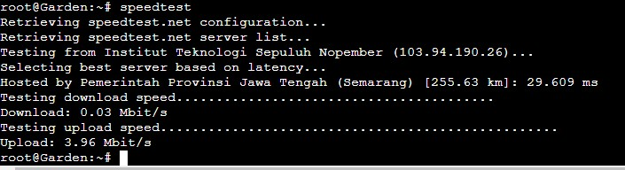


## **Soal 12**
Setelah diterapkan, ternyata peraturan nomor (4) mengganggu produktifitas saat hari kerja, dengan demikian pembatasan kecepatan hanya diberlakukan untuk pengaksesan internet pada hari libur

### **Penyelesaian Soal 12**
**[ Berlint ] -> Proxy Server** <br>
kita menambahkan konfigurasi bandwidth menjadi seperti berikut agar pembatasan kecepatan hanya diberlakukan untuk pengaksesan internet pada hari libur:

```
echo '
delay_pools 1
delay_class 1 1
delay_access 1 allow WEEKEND
delay_parameters 1 16000/16000
' > /etc/squid/acl-banwidth.conf
```

Untuk dokumentasi yaitu sebagai berikut:
<br>
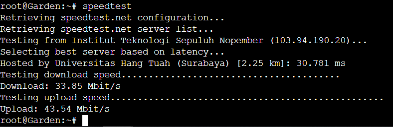


## **Kendala**
---
Terkadang syntax dalam script error dalam melakukan percobaan proxy dengan ketentuan yang terdapat pada tabel dan tidak berjalan sesuai dengan apa yang di write dalam script.